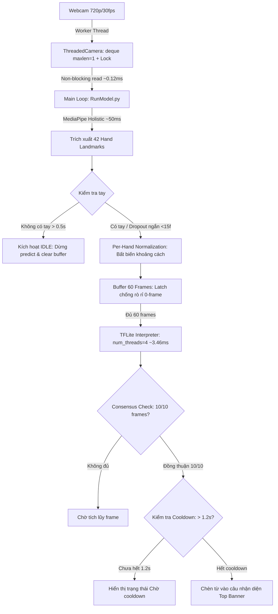

# FSign — Vietnamese Sign Language Translator (Hệ thống Dịch Ngôn ngữ Ký hiệu Tiếng Việt)

[](https://www.python.org/)
[](https://tensorflow.org/)
[](https://tensorflow.org/lite)
[](https://opencv.org/)
[](https://mediapipe.dev/)
[]()
[]()

> Dự án **FSign** là bước phát triển và nâng cấp toàn diện từ nền tảng dự án mã nguồn mở **Look & Tell**. Hệ thống giải quyết trọn vẹn các bài toán cốt lõi trong nhận diện cử chỉ ngôn ngữ ký hiệu thời gian thực: chuẩn hóa khoảng cách bất biến, kiểm soát trạng thái nghỉ (Idle), bộ lọc đồng thuận (Consensus), chống lặp từ (Cooldown), chống rò rỉ frame rỗng (Dropout Guard), và tối ưu hóa hiệu năng thời gian thực đạt tốc độ cao qua TensorFlow Lite cùng kiến trúc Camera Đa luồng (Threaded Camera).

---

## 1. Bảng So sánh Cải tiến: FSign vs Look & Tell gốc

| Tiêu chí | Look & Tell gốc (Legacy) | FSign Hiện tại (Nâng cấp) |
| :--- | :--- | :--- |
| **Mô hình & Trọng số** | Phân mảnh nhiều file (`release/94,58.h5`, `Structure/`), 60 lớp. | **Mô hình thống nhất** `model_normalized_v1.h5` và `model_normalized_v1.tflite`, **61 lớp** (bổ sung cử chỉ "xin loi" + lớp "idle"). |
| **Độ chính xác** | Đạt 94.58% (trên tập test cũ, dễ lệch scale). | **95.75%** trên 541 mẫu test holdout độc lập, bảo toàn 100% bit-exact giữa Keras và TFLite. |
| **Bất biến khoảng cách** | Không chuẩn hóa (raw coordinates), sai số nặng khi đứng xa/gần camera. | **Per-Hand Normalization** (chuẩn hóa gốc cổ tay & scale theo kích thước lòng bàn tay), nhận diện ổn định từ 0.5m đến 2.5m. |
| **Phát hiện trạng thái nghỉ** | Không có (dự đoán liên tục gây spam từ rác khi buông tay). | **Idle Detection (Time-based, threshold = 0.5s)**: Tự động ngắt dự đoán khi buông tay, xóa sạch từ rác. |
| **Chống nhảy nhãn (Flickering)** | Dự đoán theo từng frame đơn lẻ. | **Consensus Window (10/10 frame)**: Chỉ kích hoạt từ khi có 10 frame liên tiếp đồng thuận tuyệt đối. |
| **Kiểm soát lặp từ** | Không có (giữ tay 1 giây sinh ra hàng loạt từ lặp). | **Cooldown Time-based (1.2s)**: Khóa nhận diện tạm thời sau khi chèn từ, ngăn ngừa spam từ liên tục. |
| **Xử lý mất dấu tay ngắn hạn** | Chèn frame `[0, 0, ...]` làm hỏng bộ đệm LSTM. | **Dropout Zero-Frame Guard**: Cơ chế chốt giữ frame cũ (latch) trong khoảng mất tay ngắn (< 15 frames), duy trì tính liên tục cho LSTM. |
| **Độ trễ suy luận (Model Latency)** | 38.74 ms (Keras `.h5` trên CPU). | **3.46 ms** (TFLite Engine, CPU 4 threads) — **Tăng tốc 11.20x**. |
| **Kích thước mô hình** | 1.90 MB (`.h5`). | **0.64 MB** (`.tflite`) — **Nén 66.4%**. |
| **Tốc độ đọc Webcam I/O** | 8.01 ms/frame (OpenCV `cap.read()` blocking đồng bộ). | **0.12 ms/frame** (**ThreadedCamera** Producer-Consumer không chặn) — **Giảm trễ 66x**. |
| **FPS thực tế khi nhận diện** | 9.1 FPS (chậm, giật hình). | **16.4 – 16.7 FPS** (Active Predict), Session Overall đạt **17.1 FPS**, Peak **30.0 FPS** (+83.5% so với baseline). |

---

## 2. Kiến trúc Hệ thống



---

## 3. Cấu trúc Thư mục Dự án

```text
Sign-Language-Translator/
├── README.md                               # Tài liệu dự án FSign
├── setup_env.ps1 / setup_tf25.bat          # Script thiết lập môi trường
└── Sign Language Translator/
    ├── RunModel.py                         # Ứng dụng nhận diện thời gian thực chính (TFLite + Threaded Camera + B1-B5)
    ├── model_def.py                        # Định nghĩa kiến trúc mạng LSTM
    ├── preprocessing.py                    # Module chuẩn hóa tiền xử lý dữ liệu (Per-Hand Normalization)
    ├── dataset_loader.py                   # Loader nạp dữ liệu huấn luyện & cache
    ├── train_model.py                      # Script huấn luyện mô hình FSign 61 nhãn
    ├── convert_and_benchmark_tflite.py     # Script chuyển đổi Keras sang TFLite & benchmark độ chính xác/độ trễ
    │
    ├── Models/
    │   ├── model_normalized_v1.tflite      # Mô hình TFLite chính thức (0.64 MB, CPU latency 3.46ms)
    │   └── model_normalized_v1.h5          # Checkpoint Keras gốc (1.90 MB, test accuracy 95.75%)
    │
    ├── Data_normalized/                    # Tập dữ liệu 61 nhãn đã chuẩn hóa per-hand (chứa dataset_cache.npz)
    │
    ├── run_all_b_tests.py                  # Test runner tự động chạy toàn bộ 5 test cases B1-B5
    ├── test_b1_pipeline.py                 # Unit test B1: Bất biến khoảng cách camera
    ├── test_b2_idle.py                     # Unit test B2: Cơ chế Idle time-based (0.5s)
    ├── test_b3_consensus.py                # Unit test B3: Bộ lọc đồng thuận 10/10 frame
    ├── test_b4_cooldown.py                 # Unit test B4: Bộ lọc cooldown chống spam từ (1.2s)
    ├── test_b5_dropout.py                  # Unit test B5: Chống rò rỉ frame zero khi dropout ngắn
    ├── test_c3_threaded_camera.py          # Unit test C3: Kiểm thử ThreadedCamera (4/4 tiêu chí)
    │
    ├── benchmark_c1_fps.log                # Log benchmark baseline Keras .h5
    ├── benchmark_c2_tflite.log             # Log benchmark chuyển đổi TFLite & accuracy holdout
    ├── benchmark_c2_realtime_fps.log       # Log benchmark webcam TFLite single-thread
    └── benchmark_c3_threaded_fps.log       # Log benchmark webcam TFLite Threaded Camera
```

---

## 4. Hướng dẫn Cài đặt & Chạy Thực tế

### 4.1. Cài đặt Môi trường
Hệ thống khuyến nghị sử dụng Python 3.8 – 3.10:
```bash
pip install tensorflow opencv-python mediapipe numpy scikit-learn matplotlib
```

### 4.2. Khởi chạy Ứng dụng Dịch Thời gian thực (RunModel.py)
Chạy script chính để mở giao diện webcam:
```bash
cd "Sign Language Translator"
python RunModel.py
```
* **Màn hình hiển thị:**
  - **Top Banner (cam):** Hiển thị câu nhận diện (tối đa 5 từ gần nhất).
  - **Status Line (xanh lá / cam):** Trạng thái hoạt động (`Dang phat hien cu chi...`, `IDLE - Nghi...`, `Cho cooldown...`).
  - **FPS Badge (góc trên phải):** Đo đếm FPS thời gian thực.
* **Thao tác:**
  - Đưa tay trước camera thực hiện cử chỉ.
  - Hạ tay xuống: hệ thống tự động nhận biết trạng thái `IDLE` sau 0.5s.
  - Nhấn phím **`q`** trên cửa sổ hiển thị để thoát chương trình và tự động xuất log hiệu năng ra file `benchmark_c3_threaded_fps.log`.

---

## 5. Danh sách Kịch bản Kiểm thử Tự động (Test Suites)

Tất cả các cơ chế đã được kiểm thử độc lập và kiểm thử tích hợp tự động:

| Kịch bản | Lệnh thực thi | Mục tiêu kiểm thử | Trạng thái |
| :--- | :--- | :--- | :---: |
| **Toàn bộ Giai đoạn B** | `python run_all_b_tests.py` | Chạy tuần tự và tổng hợp kết quả của cả 5 bài test B1 – B5. | **PASS (5/5)** |
| **Test B1 (Pipeline)** | `python test_b1_pipeline.py` | Kiểm tra tính bất biến khoảng cách (scale invariance) từ 0.5m đến 2.5m. | **PASS** |
| **Test B2 (Idle)** | `python test_b2_idle.py` | Xác minh cơ chế ngắt thời gian thực khi không có tay sau 0.5 giây. | **PASS** |
| **Test B3 (Consensus)** | `python test_b3_consensus.py` | Kiểm tra yêu cầu đồng thuận 10/10 frame liên tiếp trước khi xác nhận từ. | **PASS** |
| **Test B4 (Cooldown)** | `python test_b4_cooldown.py` | Kiểm tra thời gian chờ 1.2s chống lặp lại từ khi người dùng giữ nguyên tay. | **PASS** |
| **Test B5 (Dropout)** | `python test_b5_dropout.py` | Kiểm tra tính năng giữ frame cũ (latch), chống suy giảm accuracy do frame 0. | **PASS** |
| **Test C3 (Camera I/O)** | `python test_c3_threaded_camera.py` | Kiểm thử đa luồng Producer-Consumer, buffer maxlen=1, thread-safety, clean stop. | **PASS (4/4)** |
| **Benchmark TFLite (C2)** | `python convert_and_benchmark_tflite.py` | Kiểm định bit-exact 541/541 mẫu test và đo độ trễ suy luận trên CPU. | **PASS** |

---

## 6. Bản quyền & Kế thừa
- Dự án phát triển dựa trên nền tảng ban đầu của [Look & Tell](https://github.com/khooinguyeen/LookandTell-OfficialApp).
- Giấy phép phân phối: [Apache License 2.0](LICENSE).
